# Azure VM Server Preparation

### New server establish
* Azure URL : <https://portal.azure.com>

## Basic Setting

* Click "가상머신" in top menu
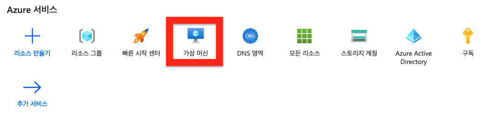</img>

* Click "만들기 &rarr; Azure 가상 머신" in top menu
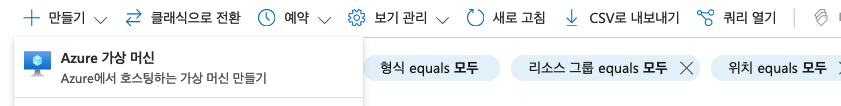</img>

### 기본사항
* 리소스 그룹 :  YPORTAL
* 가상 머신 이름 : ex) monitor
*  지역 : (Asia Pucific) Korea Central
*  이미지 :  Ubuntu
*  크기 :  Standard_B1s
*  인증 형식  : SSH 공개키
*  사용자 이름 : cupadmin
*  SSH 공개 키 원본 : 기존 퍼블릭 키 사용 &rarr; 공개키 복사, 붙여넣기
*  공용 인바운드 포트 : 선택한 포트 허용 &rarr; 80, 443, 22

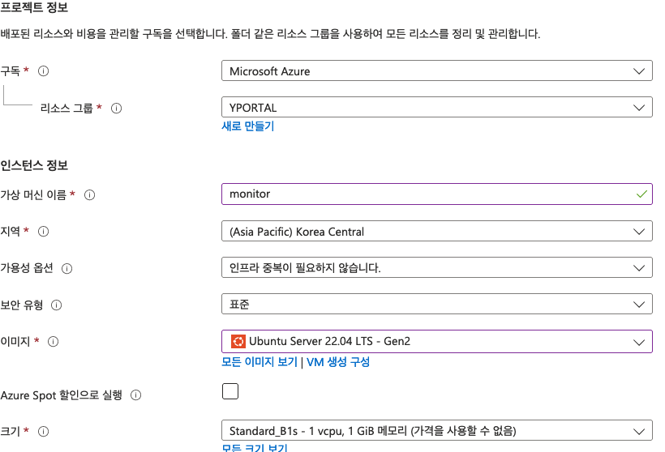</img>
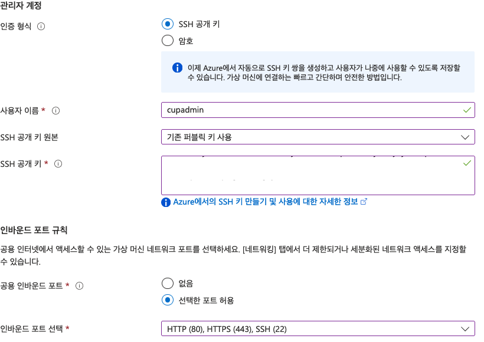</img>

### 디스크
* OS 디스크 유형 : 표준 SDD / HDD 택
* 데이터 양이 많을것으로 예상되면, 새 디스크 만들기 및 연결

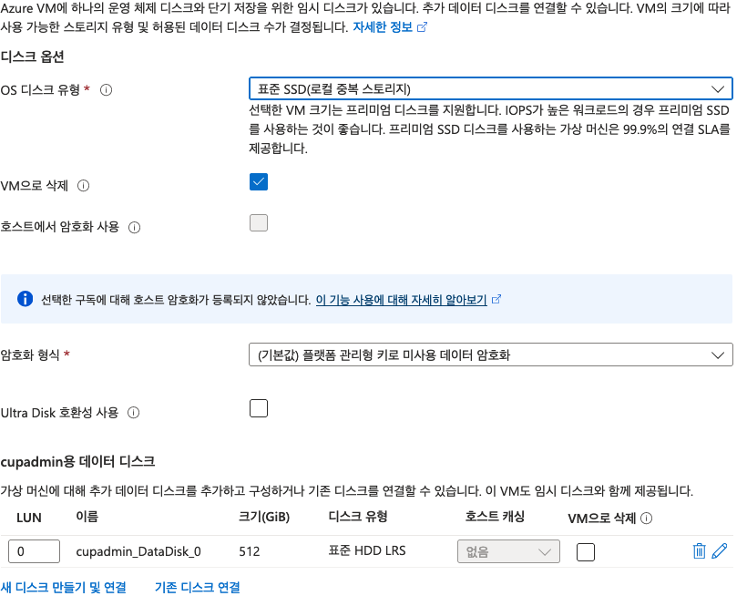</img>
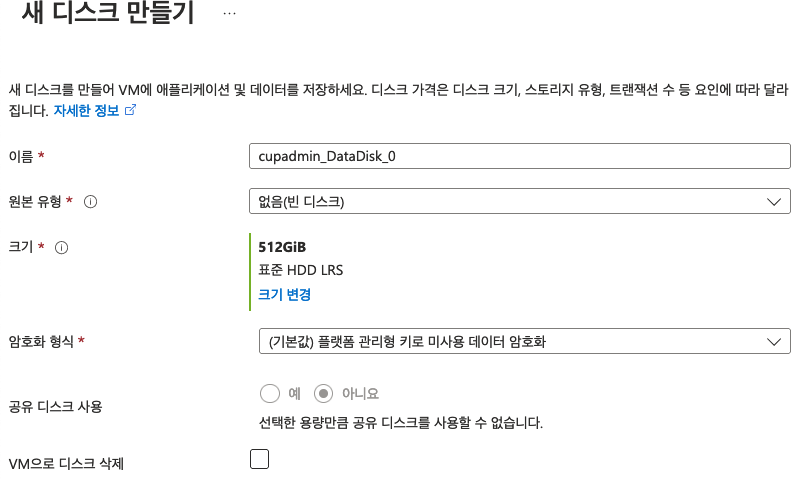</img>

* 이후 만들기

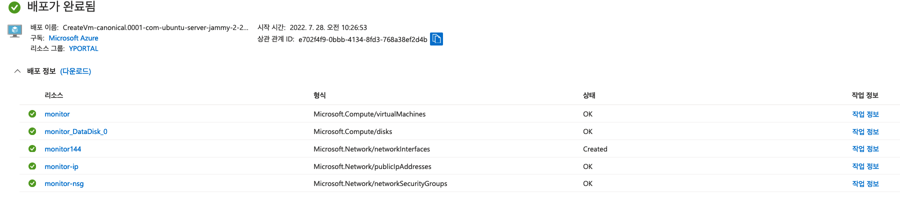</img>

* Click "리소스로 이동"

### DNS setting
* DNS 이름 : 구성되지 않음 

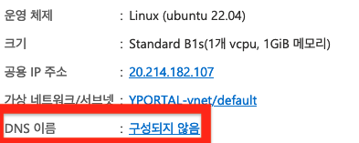</img>

* DNS 이름 레이블
 
 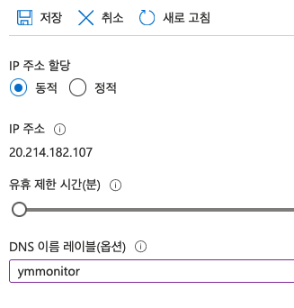</img>
 
* `yemilab.kr` 설정
	*  Click "DNS 영역" &rarr; Click "yemilab.kr" &rarr; Click "+레코드 집합"
	
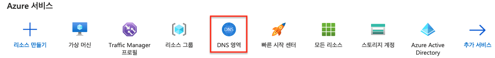</img>

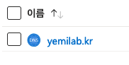</img>

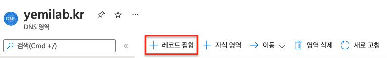</img>

* Prepare 
	*  `monitor`
	*  `grafana.monitor`
	*  `influxdb.monitor`

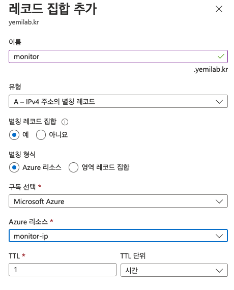</img>
