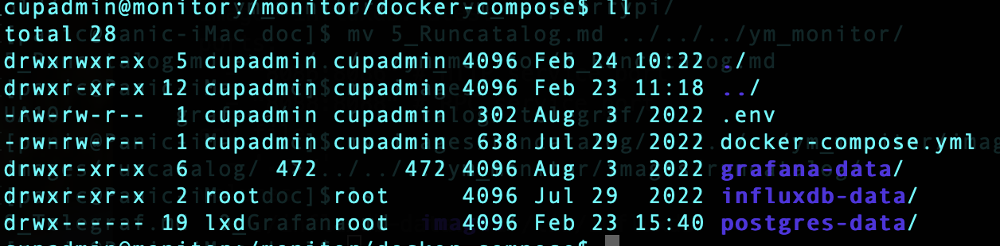

# Docker
<hr/>

* By Docker & Docker-compose, we will install InfluxDB and Grafana to Monitor server

### Contents
1.	[Install Docker](#install-docker)
2. [Install Docker-Compose](#install-docker-compose)
3. [Setting Docker-Compose](#setting-docker-compose)
4. [ETC](#etc)

<hr/>

## Install Docker

* Install
	* `sudo mkdir -p /etc/apt/keyrings`
	* `curl -fsSL https://download.docker.com/linux/ubuntu/gpg | sudo gpg --dearmor -o /etc/apt/keyrings/docker.gpg`
	* `echo \
  "deb [arch=$(dpkg --print-architecture) signed-by=/etc/apt/keyrings/docker.gpg] https://download.docker.com/linux/ubuntu \
  $(lsb_release -cs) stable" | sudo tee /etc/apt/sources.list.d/docker.list > /dev/null`
	* `sudo apt-get update`
	* `sudo apt-get install docker-ce docker-ce-cli containerd.io docker-compose-plugin`

* Service start
	* `sudo systemctl start docker`
	* `sudo systemctl enable docker`

## Install Docker-Compose

* Reference 
	* <https://docs.docker.com/compose/>
	* <https://docs.docker.com/compose/reference/>

* Download the current stable release of Docker-Compose (Check latest version)
	* `sudo curl -L "https://github.com/docker/compose/releases/download/v2.6.1/docker-compose-$(uname -s)-$(uname -m)" -o /usr/local/bin/docker-compose`

* Apply executable permissions to the binary
	* `sudo chmod +x /usr/local/bin/docker-compose`

## Setting Docker-compose

* `cd /monitor`
* `mkdir docker-compose; cd docker-compose`
* `touch docker-compose.yml .env`

* docker-compose.yml

```
version: '3'
services:
  influxdb:
    image: influxdb:latest
    ports:
      - "8086:8086" # HTTP service port
      - "8088:8088" # RPC service port
    env_file:
      - '.env'
    volumes:
      - ./influxdb-data:/var/lib/influxdb
    restart: always

  postgres:
    image: postgres:latest
    env_file:
      - '.env'
    volumes:
      - ./postgres-data:/var/lib/postgresql/data
    restart: always

  grafana:
    image: grafana/grafana:latest
    ports:
      - "3000:3000"
    env_file:
      - '.env'
    volumes:
      - ./grafana-data:/var/lib/grafana
    depends_on:
      - influxdb
      - postgres
    restart: always
```

* .env

```
POSTGRES_DB=postgres
POSTGRES_USER=postgres
POSTGRES_PASSWORD=postgres
GF_SERVER_DOMAIN=grafana.monitor.yemilab.kr
GF_SERVER_ROOT_URL=https://grafana.monitor.yemilab.kr
GF_DATABASE_TYPE=postgres
GF_DATABASE_HOST=postgres
GF_DATABASE_NAME=postgres
GF_DATABASE_USER=postgres
GF_DATABASE_PASSWORD=postgres
```

* Change Permission
	* `sudo chmod 666 /var/run/docker.sock`
 
* Start docker-compose service
	* `docker-compose up -d`

* Change permission : Grafana data directory need `472` id
	* `sudo chown 472:472 grafana-data`

</img>

## ETC
* In the [files](./files/3_docker),
	* `docker-compose.yml`
		* (move to `/monitor/docker-compose/`)
	* `env`
		* (move & rename to `/monitor/docker-compose/.env`)
