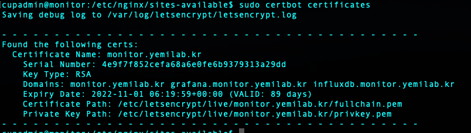
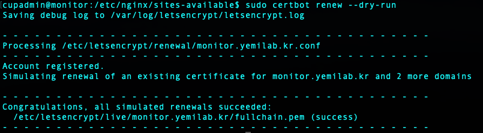
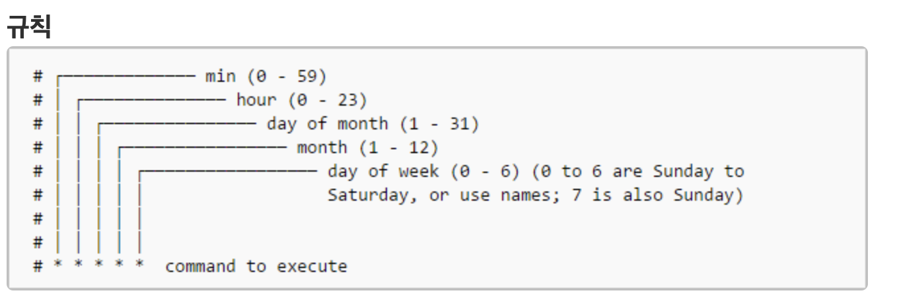

# Name Server Setting
<hr/>

[1. Nginx Installation](#nginx-installation)

[2. Nginx Setting](#nginx-setting)

[3. Certbot - SSL certificates](#certbot-ssl-certificates)

[4. Renew Certificate](#renew-certificate)

* Reference
	* Nginx <https://www.nginx.com>
	* Certbot <https://certbot.eff.org>

<hr/>

## Nginx Installation

* Install Nginx
	* `sudo apt install nginx`

* Service start
	* `sudo systemctl start nginx`
	* `sudo systemctl enable nginx`	

## Nginx Setting

* Webpage, Influxdb, Grafana
	* `cd /etc/nginx/sites-available`

	* runcatalog
	
	```
	server {
		server_name monitor.yemilab.kr;
		root /monitor/www/html;
		index index.html;

		auth_basic "Yemilab runcatalog";
		auth_basic_user_file /etc/nginx/htpasswd;

		location /app/ {
			proxy_set_header X-Forwarded-Host $host:$server_port;
			proxy_set_header X-Forwarded-Server $host;
			proxy_set_header X-Forwarded-For $proxy_add_x_forwarded_for;
			proxy_set_header X-Script-Name /app;
			proxy_pass http://localhost:8000/;
		}
	}

	server {
		server_name monitor.yemilab.kr;
		listen 80;
	}
	```
	
	* Influxdb
	
	```
	server {
		server_name influxdb.monitor.yemilab.kr;
		root /monitor/www/html;
		index index.html;

		location / {
			proxy_pass http://localhost:8086/;
		}
	}
	```
	
	* Grafana
		
	```
	server {
		server_name grafana.monitor.yemilab.kr;
		root /monitor/www/html;
		index index.html;

		location / {
			proxy_pass http://localhost:3000/;
			proxy_set_header Host $http_host;
		}
	}
	```

* Make a link to enable
	* `cd /etc/nginx/sites-enabled`
	* `sudo ln -s ../sites-available/run_catalog`
	* `sudo ln -s ../sites-available/grafana`
	* `sudo ln -s ../sites-available/influxdb`

## Certbot - SSL certificates

* Reference <https://certbot.eff.org>
	* Change Combo box
		* Software &rarr; Nginx
		* System &rarr; Ubuntu 20
	</img>

* Certbot : 
	* Connection with port &rarr; without port
	* HTTP &rarr; HTTPS

* Install core : `sudo snap install core; sudo snap refresh core`
* Install Certbot : `sudo snap install --classic certbot`
* Prepare command : `sudo ln -s /snap/bin/certbot /usr/bin/certbot`

* Get certificate & update Nginx setting : `sudo certbot --nginx`

## Renew Certificate

* The certificate is a short-term certificate for 90 days

* So we must renew certificate every 90 days

* Check expired date : `sudo certbot certificates`

</img>

* Renew Test : `sudo certbot renew --dry-run`
	* If there are no problems with the renewal process, you can achieve "success"
	
</img>

* Renew : `sudo certbot renew`

### Renew certificate automatically by Crontab

* Crontab rule

</img>

* Make executable file (`chmod +x file_name`) at `/bin/`

```
!/bin/bash

date >> /var/log/nginx/renew.log
/usr/bin/certbot renew --post-hook "systemctl restart nginx" >> /var/log/nginx/renew.log
```
* Crontab scheduler setting

`sudo crontab -e`

* Renew certificate 0:00, 1st day, every month 

`0 0 1 * * file_name`

* Log : `/var/log/nginx/renew.log`