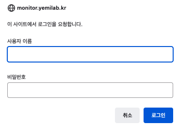

# Runcatalog

<hr/>

## Pre-Install

* web-passwd setting
	* `sudo apt install apache2-utils`
	* `sudo htpasswd -c /etc/nginx/htpasswd ym`
	* Connect `https://monitor.yemilab.kr` (After [4_DNS](./4_DNS.md) setting)
		* ID : ym, PW : Setting
	</img>
	
* Install package (python environment)
	* `sudo apt install python3.10-venv`
	* `cd /monitor; python3 -m venv venv`
	* `source /monitor/venv/bin/activate`
	* `pip install Flask gunicorn`
	
## Runcatalog

* Runcatalog template (reference)
	* `git clone https://github.com/yemilab/runcatalog-webapp-template.git`

* `cd /monitor; mkdir www;`
* `cd www; mkdir html uploads ymapp`

### html
* `cd /monitor/www/html; mkdir webcam1`
* Fill `index.html`

```html
<html>
  <head>
    <title>Welcome to Yemilab internal</title>
    <meta http-equiv="Refresh" content="0; url=/app/">
  </head>
  <body>
    <p>
      Please follow <a href="/app/">this link</a>.
    </p>
  </body>
</html>
```

### ymapp
* `cd /monitor/www/ymapp; mkdir app log`
* Fill `app.cfg`

```
SECRET_KEY = 'SECRET_KEY'
UPLOAD_FOLDER = '/monitor/www/uploads'
MAX_CONTENT_PATH = 104857600
```

* Secret key generate
	* `python3`

	```python
	import secrets
	secrets.token_hex(16)
	```

* `cd app; mkdir templates`
* Need `__init__.py`, `ymmon.py`

* `__init__.py`

```python
import os
from .ymmon import app

app.config.from_object(__name__)
app.config.update(dict(
	SECRET_KEY='development key',
))
try:
	app.config.from_envvar('YEMILABWEBAPP_SETTINGS')
except RuntimeError:
	pass

# Ref: http://flask.pocoo.org/snippets/35/                                                                       
class ReverseProxied(object):
	'''Wrap the application in this middleware and configure the                                                 
	front-end server to add these headers, to let you quietly bind                                               
	this to a URL other than / and to an HTTP scheme that is                                                     
	different than what is used locally.                                                                         

	In nginx:                                                                                                    
	location /myprefix {                                                                                         
		proxy_pass http://192.168.0.1:5001;                                                                      
		proxy_set_header Host $host;                                                                             
		proxy_set_header X-Forwarded-For $proxy_add_x_forwarded_for;                                             
		proxy_set_header X-Scheme $scheme;                                                                       
		proxy_set_header X-Script-Name /myprefix;                                                                
		}                                                                                                        

	:param app: the WSGI application                                                                             
	'''
	def __init__(self, app):
		self.app = app

	def __call__(self, environ, start_response):
		script_name = environ.get('HTTP_X_SCRIPT_NAME', '')
		if script_name:
			environ['SCRIPT_NAME'] = script_name
			path_info = environ['PATH_INFO']
			if path_info.startswith(script_name):
				environ['PATH_INFO'] = path_info[len(script_name):]
		
		scheme = environ.get('HTTP_X_SCHEME', '')
		if scheme:
			environ['wsgi.url_scheme'] = scheme
		return self.app(environ, start_response)

app.wsgi_app = ReverseProxied(app.wsgi_app)
```

* `ymmon.py`

```python
import os
import time
import datetime
from pathlib import Path
import re
import shutil

from flask import Flask, request, session, g, redirect, url_for, abort, render_template, flash, jsonify, send_from_directory
from werkzeug.utils import secure_filename
from werkzeug.datastructures import ImmutableMultiDict

app = Flask(__name__)

app.config.update(
	DEBUG = True,
	TESTING = True,
	SECRET_KEY = 'development',
	UPLOAD_FOLDER = './uploads',
	MAX_CONTENT_PATH = 10485760, # 10MB                                                                          
)

@app.route('/')
def index():
	return render_template(
		'index.html',
	)

@app.route('/webcam1')
def webcam1():
	return render_template(
		'webcam1.html',
	)
```

### templates
* `cd /monitor/www/ymapp/app/templates`
* Need `index.html`, `layout.html`, `webcam1.html`
* `index.html`

```html


<div class="content">
	<h2>Yemilab</h2>
</div>

```

* `layout.html`

```html
<!DOCTYPE html>
<html>
<head>
	<meta charset="utf-8">
	<title>Yemilab Page</title>

	<meta name="viewport" content="width=device-width, initial-scale=1">
	<link rel="stylesheet" href="https://cdnjs.cloudflare.com/ajax/libs/bulma/0.7.5/css/bulma.min.css">  
	<link rel="stylesheet" href="https://cdn.jsdelivr.net/npm/flatpickr/dist/flatpickr.min.css">
	<script src="https://cdn.jsdelivr.net/npm/flatpickr"></script>
	<script src="https://kit.fontawesome.com/2755366bb5.js"></script>
	<script>
		document.addEventListener('DOMContentLoaded', () => {
			// Get all "navbar-burger" elements
			const $navbarBurgers = Array.prototype.slice.call(document.querySelectorAll('.navbar-burger'), 0);
			// Check if there are any navbar burgers
			if ($navbarBurgers.length > 0) {
				// Add a click event on each of them
				$navbarBurgers.forEach( el => {
					el.addEventListener('click', () => {
						// Get the target from the "data-target" attribute
						const target = el.dataset.target;
						const $target = document.getElementById(target);
						// Toggle the "is-active" class on both the "navbar-burger" and the "navbar-menu"
						el.classList.toggle('is-active');
						$target.classList.toggle('is-active');
					});
				});
			}
		});
	</script>
</head>
<body>
	<div class="container">
		<!-- Static navbar -->
		<nav class="navbar" role="navigation" aria-label="main navigation">
			<div class="navbar-brand">
			<a class="navbar-item" href="{{ url_for('index') }}">
				Home
			</a>
			<a role="button" class="navbar-burger" aria-label="menu" aria-expanded="false" data-target="navbarYemilabWeb">
				<span aria-hidden="true"></span>
				<span aria-hidden="true"></span>
				<span aria-hidden="true"></span>
			</a>
			</div>
			<div id="navbarYemilabWeb" class="navbar-menu">
				<div class="navbar-start">
					<a class="navbar-item" href="{{ url_for('webcam1') }}">LN2 Webcam</a>
					<a class="navbar-item" href="https://grafana.monitor.yemilab.kr/">Grafana
						<span class="icon is-medium">
							<i class="fas fa-external-link-alt"></i>
						</span>
					</a>
				</div>
			</div>
		</nav>

		
			
				
				<article class="message is-{{ category }}">
					<div class="message-body">{{ message }}</div>
				</article>
				
			
		

		
	</div> <!-- container -->
	
</body>
</html>
```

* `webcam1.html`

```html


<div class="content has-text-centered">
	<h2>Webcams</h2>
	<p>Reloaded at: <span id="datetime"></span></p>
	<figure>
		<p>
			
		</p>
	</figure>
</div>



<script>
	(function() {
		var imageElem = document.getElementById('webcam');
		var dateElem  = document.getElementById('datetime');
		dateElem.innerHTML = new Date();
		setInterval(function() {
			t = new Date();
			imageElem.src = '/webcam1/webcam.png?t=' + t.getTime();
			dateElem.innerHTML = t;
		}, 60000);
	})();
</script>

```

## Supervisor
* Install supervisor
	* `sudo apt install supervisor`
	* modify `supervisor.conf`
		* [supervisord] logfile : location &rarr; /monitor/log
		* [include] files : location &rarr; /monitor/supervisor

	* First stage :
		* `cd /monitor; mkdir log supervisor`

	* Runcatalog Supervisor script : `ym.conf`
	
	```
	[program:ym_app]
	directory = /monitor/www/ymapp
	process_name = %(program_name)s
	command = /monitor/venv/bin/gunicorn app:app
	stdout_logfile = /monitor/www/ymapp/log/app.log
	redirect_stderr = true
	autostart = true
	autorestart = unexpected
	user = cupadmin
	environment = YMWEBAPP_SETTINGS="/monitor/www/ymapp/app.cfg",GUNICORN_CMD_ARGS="-b 127.0.0.1:8000"
	```

* Run supervisor
	* `sudo systemctl start supervisor`
	* `sudo systemctl enable supervisor`